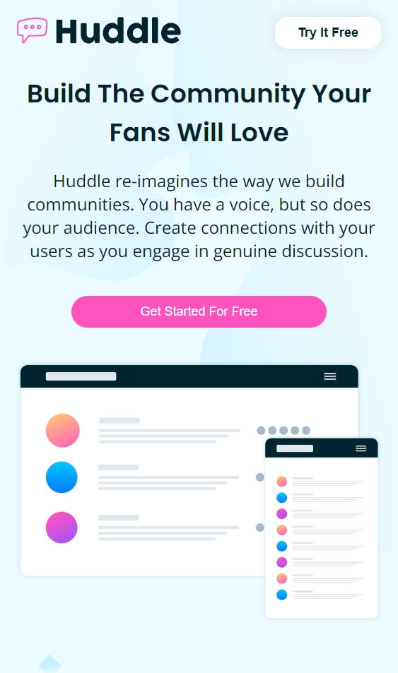
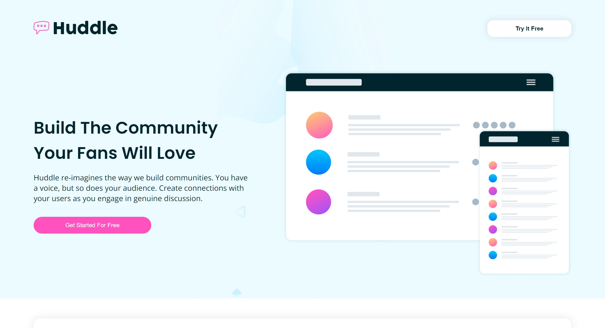

# Frontend Mentor - Huddle landing page with alternating feature blocks solution

This is a solution to the [Huddle landing page with alternating feature blocks challenge on Frontend Mentor](https://www.frontendmentor.io/challenges/huddle-landing-page-with-alternating-feature-blocks-5ca5f5981e82137ec91a5100). Frontend Mentor challenges help you improve your coding skills by building realistic projects. 

## Table of contents

- [Frontend Mentor - Huddle landing page with alternating feature blocks solution](#frontend-mentor---huddle-landing-page-with-alternating-feature-blocks-solution)
  - [Table of contents](#table-of-contents)
  - [Overview](#overview)
    - [The challenge](#the-challenge)
    - [Screenshot](#screenshot)
    - [Links](#links)
  - [My process](#my-process)
    - [Built with](#built-with)
    - [Continued development](#continued-development)
  - [Author](#author)

## Overview

### The challenge

Users should be able to:

- View the optimal layout for the site depending on their device's screen size
- See hover states for all interactive elements on the page

### Screenshot

### Links

- Solution URL: [GitHub Repo](https://github.com/varonalearns/Huddle-landing-page-with-alternating-feature-blocks)
- Live Site URL: [Vercel](https://huddle-landing-page-with-alternating-feature-blocks-tau.vercel.app/)

## My process

### Built with

- Semantic HTML5 markup
- CSS custom properties
- Flexbox
- CSS Grid
- Mobile-first workflow

### Continued development

Something that I want to work on in the future is to be more thoughtful of when I use classes and ids. I definitely need to be more mindful of how I build websites and building the foundations so that later on in the project, it is not as difficult to switch gears. Something I definitely want to continue to develop.

## Author

- Website - [Evalia Varona](https://www.evaliavarona.com)
- Frontend Mentor - [@varonalearns](https://www.frontendmentor.io/profile/varonalearns)
- Hashnode - [@evavarona](https://evaliavarona.hashnode.dev/)
